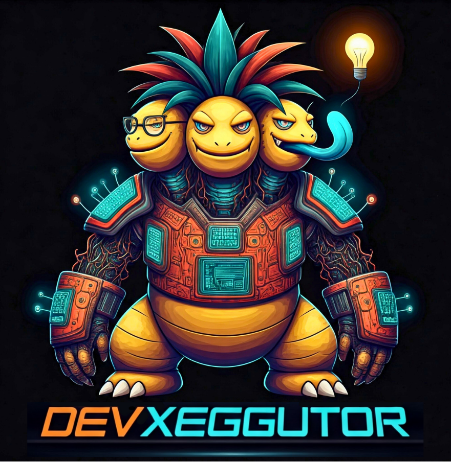

<header>
  
  <div style="float:right">
    <h1>DevXeggutor</h1>
    <p>Es un modulo que permite a los desarrolladores ejecutar comandos controlados en un servidor (recomendado en test) sin tener que acceder directamente a este.</p>
    <h3>Tecnologías:</h3>
    <div style="display:flex; gap:50px;">
    <div>
    <h5>Back-end:</h5>
    <ul>
      <li>node.js v22</li>
      <li>express.js</li>
      <li>sqlite3</li>
      <li>firebase auth</li>
    </ul>
    </div>
    <div>
    <h5>Front-end:</h5>
    <ul>
      <li>html</li>
      <li>css</li>
      <li>javascript</li>
      <li>material ui</li>
    </ul>
    </div>
    </div>
  </div>
</header>

<br>
<br>
<br>

# Antes de usar:

### ENV:

---

### RUN:

`npm intall`

### Para desarollo:

`npm run dev`

### Para producción:

`npm start`

# Guía de uso

1. Se debe crear una referencia a al proyecto
2. Se debe crear uno o más comandos asociado a un proyecto

### Enpoints

[POST] <br>
- Crea una referencia a un proyecto: `http://{base_url}:{puerto}/projects`
  - body (json): <br>
    ```json
    {
      "name": "example",
      "path": ""
    }
    ```
- Crea un comando para un proyecto especifico: `http://{base_url}:{puerto}/commands`
